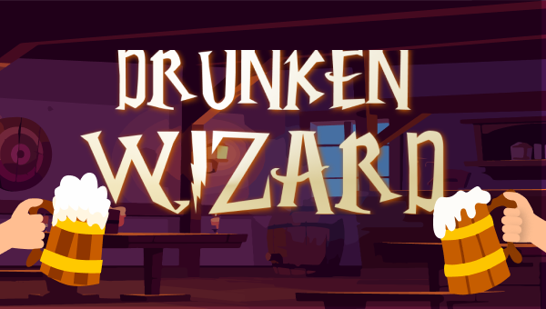
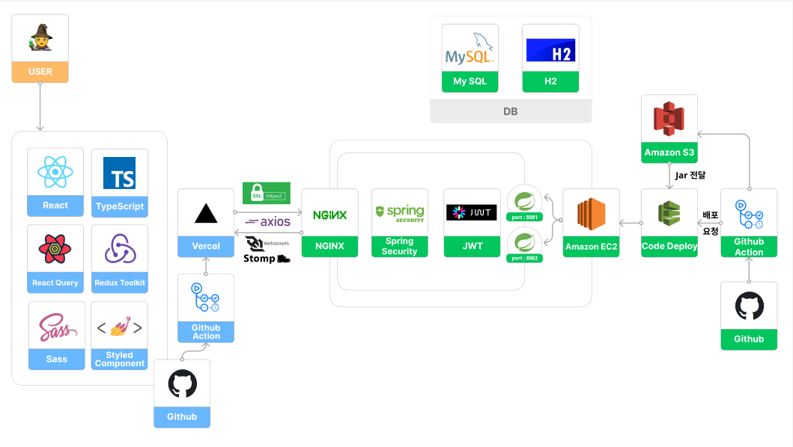
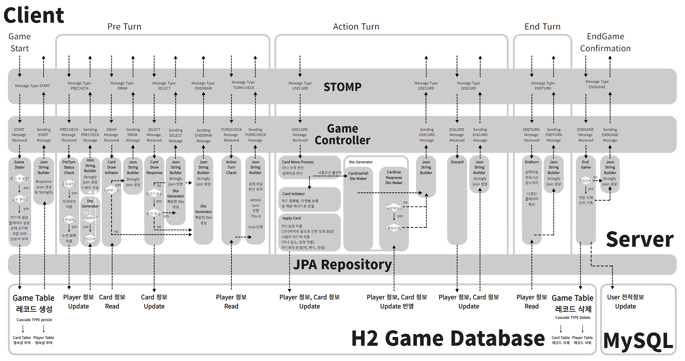

## ✨ 프로젝트 소개 🔮

- 술에 만취한 마법사들이 주점에서 시비가 붙었어요. 이러라고 배운 마법은 아니지만 주점에서 치열한 2:2 마법 카드 대전을 벌이세요!

* [🔮 Drunken Wizard 바로가기](https://drunken-wizard.com)

### 🧙 드렁큰 위자드 🍻

### 📆 프로젝트 기간

- 2022/06/24 ~ 2022/08/04

### 🏗 서비스 아키텍쳐

 💻 Back-End 주요기술 설명
 

### Web Socket (STOMP)

선택이유
<li>프론트/백엔드간 지체없는 실시간 통신을 위하여 도입</li>
 
장점
<li>게임 정보가 플레이어에게 실시간으로 보여지는 TCP 접속방식</li>
<li>TCP 연결 중에서도 구현이 단순하며 메시징 타입을 커스텀하기 용이함</li>
 
단
<li>구현과정에서 웹소켓 연결이 매우 불안정한 편이라는 사실을 알게됨 </li>
 
 

### Multiple Database

가능한 선택지
<li>IMDB(H2), Redis, MQ</li>
 
특징
<li>인메모리 데이터베이스, 레디스와 메시지 큐 모두 물리적으로 서버 내의 영역을 활용하여  작동 한다는 점에서 빠른 읽기 쓰기 속도를 구현</li>
<li>네트워크 계층을 활용하지 않고 데이터를 조회한다는 점에서 게임데이터를 저장하기 용이</li>
 
최종선택
<li>IMDB H2 데이터베이스와 MySQL의 멀티 소스 DB 구축</li>
 
선택이유
<li>빈번하게 발생하는 게임데이터 변경을 병목없이 처리하기 위해 안정성과 속도 두마리 토끼를 잡기위한 선택이 필요</li>
<li>레디스와 MQ의 경우 데이터의 저장형식이 한정적이고 데이터 조회시에 데이터 전체를 조회하게 되므로 부하로 작용가능성 존재</li>
<li>IMDB H2는 조회를 위하여 jpa 레포지토리를 활용하며 이미 그 활용법에 대해서는 지난 항해99 과정동안 익숙한 편이므로 복잡한 게임 로직 프로세싱 구조를 짜는데 유리하다고 생각하였음</li>
 
장점
<li>게임데이터처리시 IMDB의 탁월한 읽기, 쓰기 속도, 트래픽 발생 X</li>
<li>안정성이 필요한 유저데이터는 MySQL을 통해 안정적으로 저장</li>
 
단점
<li>인메모리 데이터베이스가 서버의 메모리와 CPU 사용량 일부를 점유</li>
 

### 💻 BE 게임 로직 구현

### 💻 기술 스택

 

 

 

 

 

### 🔧 주요 기능

🗨️ 게임 로비 실시간 채팅과 내 전적 확인하기!

- 여러 유저가 함께 대화할 수 있도록 게임 로비에서 다대다 채팅을 구현했습니다.
- 나만의 게임 전적을 게임 로비화면에서 확인할 수 있습니다.

🎮 게임방에 입장해, 내 팀을 정해보자!

- 유저는 게임방을 직접 개설할 수도 있고, 다른 유저가 만든 방에 입장해도 됩니다!
- 원하는 팀을 선택해 게임을 플레이할 수도 있답니다!

🧙 실시간 2:2 마법사 카드 대전게임!

- 공격, 보조, 아이템, 저주 등 4가지 타입의 다양한 카드를 이용한 2:2 카드 게임을 구현했습니다.
- 각 캐릭터마다의 고유 특성이 있어, 직업에 따른 다양한 전략을 구상할 수 있습니다.

### 💖 About Back-end

#### 👪 &nbsp; 팀원

|   이름    |         깃허브 주소         |  역할  |
| :-------: | :-------------------------: |:----:|
|  서만원 | https://github.com/Luwin-Seo | [리더] |
|  이영균  | https://github.com/lirongzzuin | [조원] |
|  장현석  | https://github.com/Mo-Greene | [조원] |
